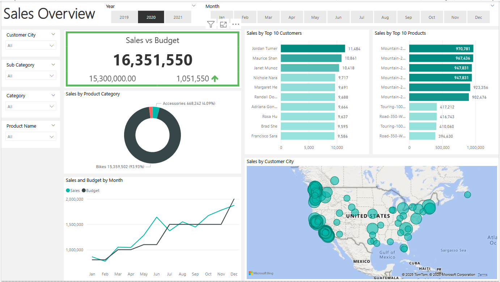

# 📊 Business Sales Analysis Dashboard

A comprehensive sales analysis project that leverages **SQL**, **Excel**, and **Power BI** to extract insights from business sales data and visualize key performance metrics.

---

## 🚀 Project Overview

This project aims to analyze business sales data and provide actionable insights through interactive dashboards. The process involves:
- Data extraction and transformation using **SQL**
- Exploratory analysis and KPI calculation in **Excel**
- Visualization and reporting through **Power BI**

---

## 🛠️ Tools & Technologies
- **SQL** – Data extraction, joins, filtering, aggregation.
- **Microsoft Excel** – Data cleaning, calculated fields, trend identification.
- **Power BI** – Dashboard design, slicers, visual storytelling.

---

---

## 🧠 Key Insights

- 🔍 Identified top-selling products by region and time.
- 📈 Analyzed monthly and quarterly revenue trends.
- 🧾 Tracked performance of sales representatives.
- 📊 Provided a dynamic dashboard to filter data by region, category, and time.

---

## 📸 Screenshots

### 🔷 Power BI Dashboard Overview



---

## 📌 How to Run the Project

1. Clone the repository:
   ```bash
   git clone https://github.com/your-username/business-sales-analysis.git
Import the SQL file into your database and run queries to extract data.

Open SalesData.xlsx in Excel to review cleaned data and KPIs.

Open PowerBI Dashboard.pbix in Power BI Desktop to explore the dashboard.

📬 Contact
---
If you have any questions or suggestions, feel free to reach out:

💼 GitHub: Riznxz

📧 Email: riznxz@example.com

⭐️ Show Your Support
If you like this project, please ⭐️ the repo to support the work!


Tools


